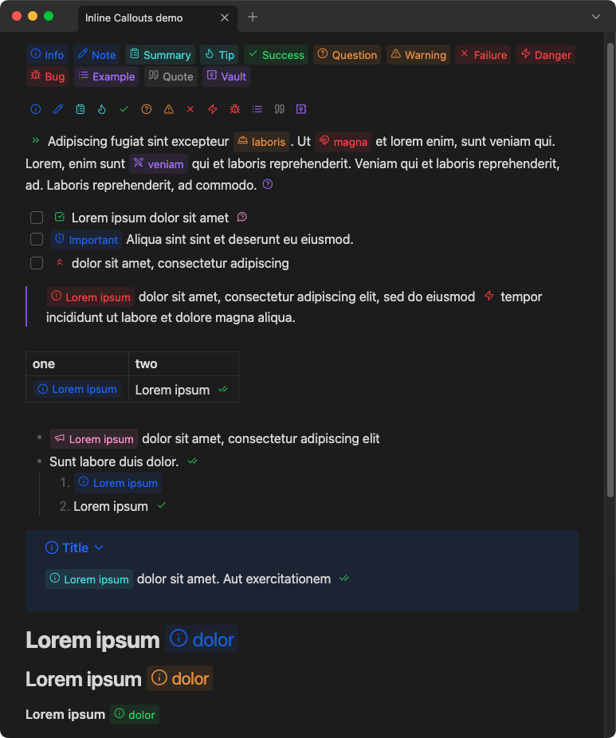
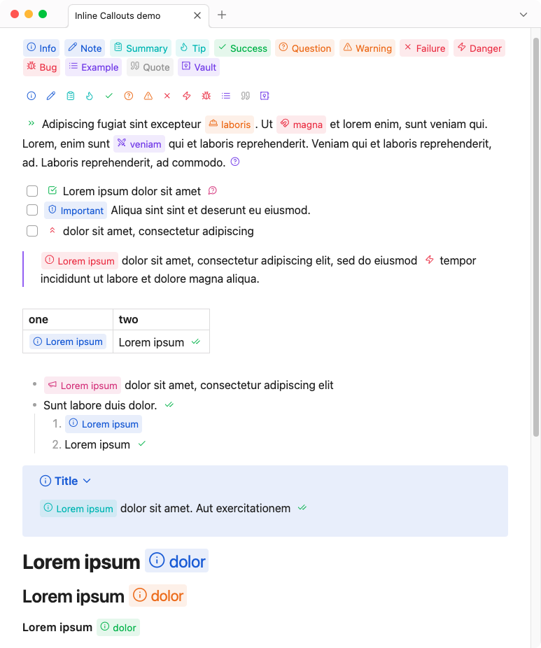

# Inline Callouts

## Introduction

A plugin for displaying inline "callouts" in [Obsidian.md](https://github.com/obsidianmd), a successor to the [Badges](https://github.com/gapmiss/badges) plugin by the same author. Key differences: simpler syntax, access to all Lucide icons used by Obsidian, modal interfaces for icon suggestions, new inline callout and modify inline callout.

- [Demo](#demo)
- [Features](#features)
- [Usage](#usage)
- [Caveats](#caveats)
- [Installation](#installation)
- [CSS styles](#css)
- [Style Settings plugin](#style-settings-plugin)
- [Development](#development)
- [Credits](#credits)
- [Notes](#notes)

## Demo

> [!NOTE]
> See demo markdown file [here](./demo/example.md)





## Features

### New Inline Callout modal

<details style="margin-block: 1em;">
	<summary>👇️ Show GIF screencast</summary>
	<p></p>
	<p>
		
	</p>
</details>

### Modify Inline Callout Modal

<details style="margin-block: 1em;">
	<summary>👇️ Show GIF screencast</summary>
	<p></p>
	<p>
		
	</p>
</details>

### Icon suggestion modal

<details style="margin-block: 1em;">
	<summary>👇️ Show GIF screencast</summary>
	<p></p>
	<p>
		
	</p>
</details>

### Search for inline callout modal

<details style="margin-block: 1em;">
	<summary>👇️ Show GIF screencast</summary>
	<p></p>
	<p>
		
	</p>
</details>

### Settings

<details style="margin-block: 1em;">
	<summary>👇️ Show screenshot</summary>
	<p></p>
	<p>
		
	</p>
</details>

### Compatible with Style Settings plugin

<details style="margin-block: 1em;">
	<summary>👇️ Show screenshot</summary>
	<p></p>
	<p>
		
	</p>
</details>


## Usage

### Syntax

```markdown
`[!!ICON|LABEL|COLOR]`
```

| Syntax            | Details                        |
| ----------------- | ------------------------------ |
| `ICON`            | Name of the Lucide icon        |
| `LABEL`(optional) | Callout label/title text       |
| `COLOR`(optional) | RGB values or Obsidian CSS var |


> [!IMPORTANT]
> The `LABEL` cannot contain either the `|` pipe or the <code>`</code> backtick symbols, as they are used as delimiters for the custom syntax.

## Caveats

- Consecutive callouts must be separated by at lease one space, character, or line return to be rendered correctly in reading view.
- Does not work inside a wiki-link
- Markdown and HTML code is NOT rendered in the callout label
- When using inline callouts in a table, the pipe characters must be escaped by a backslash `\`. e.g.:
	```
	| example                                  |
	| ---------------------------------------- |
	| `[!!info\|Lorem\|var(--color-blue-rgb)]` |
	```

## Installation

[Find at Obsidian.md/plugins](https://obsidian.md/plugins?search=inline-callouts)

From Obsidian's settings:

1. Community Plugins > Browse
2. Search for "Inline Callouts"

Via BRAT (Beta Reviewer's Auto-update Tool):

1. Ensure [BRAT](https://github.com/TfTHacker/obsidian42-brat) is installed
2. Trigger the command Obsidian42 - BRAT: Add a beta plugin for testing
3. Enter this repository, gapmiss/inline-callouts
4. Enable Vault Name plugin in the community plugin list


Manually:

1. download the latest [release archive](https://github.com/gapmiss/inline-callouts/releases/download/0.1.0/inline-callouts-v0.1.0.zip)
2. uncompress the downloaded archive
3. move the `inline-callouts` folder to `/path/to/vault/.obsidian/plugins/` 
4.  Settings > Community plugins > reload **Installed plugins**
5.  enable plugin

or:

1.  download `main.js`, `manifest.json` & `styles.css`
2.  create a new folder `/path/to/vault/.obsidian/plugins/inline-callouts`
3.  move all 3 files to `/path/to/vault/.obsidian/plugins/inline-callouts`
4.  Settings > Community plugins > reload **Installed plugins**
5.  enable plugin


## CSS

Custom `CSS` styles can be applied via CSS snippets. All colors and styles can be over-written just the same.

See [CSS snippets - Obsidian Help](https://help.obsidian.md/Extending+Obsidian/CSS+snippets)

### Variables

```css
body {
    --inline-callout-font-size: .85em;
    --inline-callout-font-weight: 400;
    --inline-callout-border-radius: 4px;
    --inline-callout-bg-transparency: .1;
    --inline-callout-margin: 1px;
    --inline-callout-padding-top: 1px;
    --inline-callout-padding-right: 0px;
    --inline-callout-padding-bottom: 2px;
    --inline-callout-padding-left: 0px;
    --inline-callout-icon-size: .85em;
    --inline-callout-icon-margin-top: 3px;
    --inline-callout-icon-margin-right: 3px;
    --inline-callout-icon-margin-bottom: 0px;
    --inline-callout-icon-margin-left: 5px;
    --inline-callout-label-margin-top: 2px;
    --inline-callout-label-margin-right: 5px;
    --inline-callout-label-margin-bottom: 0px;
    --inline-callout-label-margin-left: 2px;
}
```

### Obsidian.md RGB color variables

```css
var(--mono-rgb-0)
var(--mono-rgb-100)
var(--color-red-rgb)
var(--color-orange-rgb)
var(--color-yellow-rgb)
var(--color-green-rgb)
var(--color-cyan-rgb)
var(--color-blue-rgb)
var(--color-purple-rgb)
var(--color-pink-rgb)
```

## Style Settings plugin

The above `--inline-callout-*` CSS variables can be modified via the [Style Settings plugin](https://github.com/mgmeyers/obsidian-style-settings)

## Development

### Clone this repo

```bash
cd /path/to/vault/.obsidian/plugins
git clone https://github.com/gapmiss/inline-callouts.git
cd inline-callouts
```

### Install packages and run

```bash
pnpm i
pnpm run dev
```

### Enable plugin

1.  open `Settings` → `Community plugins`
2.  enable the `Inline Callouts` plugin.

## Credits

Some code inspired by and derived from:

- [chrisgurney/obsidian-note-toolbar](https://github.com/chrisgurney/obsidian-note-toolbar/)
- [javalent/admonitions](https://github.com/javalent/admonitions/)
- [Moyf/easy-copy](https://github.com/Moyf/easy-copy/)
- [nhaouari/obsidian-textgenerator-plugin](https://github.com/nhaouari/obsidian-textgenerator-plugin/)
- [steven-kraft/obsidian-markdown-furigana](https://github.com/steven-kraft/obsidian-markdown-furigana)

Thank you!

## Notes

[Lucide](https://github.com/lucide-icons/lucide) Icons: https://lucide.dev

Lucide Icons LICENSE: https://lucide.dev/license
